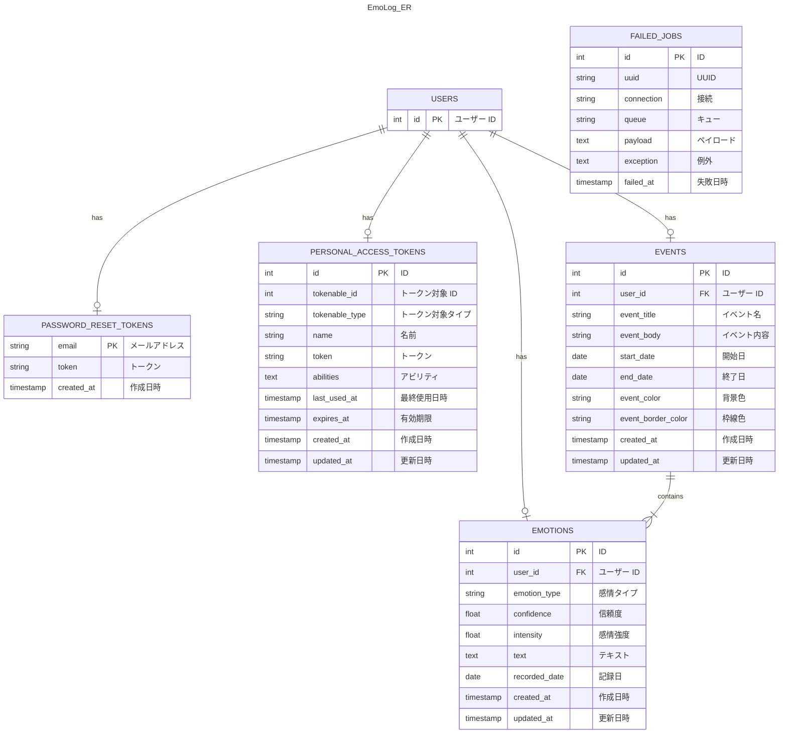

```mermaid
---
title: "EmoLog_ER"
---

erDiagram
    USERS {
        int id PK "ユーザー ID"
    }
    PASSWORD_RESET_TOKENS {
        string email PK "メールアドレス"
        string token "トークン"
        timestamp created_at "作成日時"
    }
    FAILED_JOBS {
        int id PK "ID"
        string uuid "UUID"
        string connection "接続"
        string queue "キュー"
        text payload "ペイロード"
        text exception "例外"
        timestamp failed_at "失敗日時"
    }
    PERSONAL_ACCESS_TOKENS {
        int id PK "ID"
        int tokenable_id "トークン対象 ID"
        string tokenable_type "トークン対象タイプ"
        string name "名前"
        string token "トークン"
        text abilities "アビリティ"
        timestamp last_used_at "最終使用日時"
        timestamp expires_at "有効期限"
        timestamp created_at "作成日時"
        timestamp updated_at "更新日時"
    }
    EVENTS {
        int id PK "ID"
        int user_id FK "ユーザー ID"
        string event_title "イベント名"
        string event_body "イベント内容"
        date start_date "開始日"
        date end_date "終了日"
        string event_color "背景色"
        string event_border_color "枠線色"
        timestamp created_at "作成日時"
        timestamp updated_at "更新日時"
    }
    EMOTIONS {
        int id PK "ID"
        int user_id FK "ユーザー ID"
        string emotion_type "感情タイプ"
        float confidence "信頼度"
        float intensity "感情強度"
        text text "テキスト"
        date recorded_date "記録日"
        timestamp created_at "作成日時"
        timestamp updated_at "更新日時"
    }

    USERS ||--o| EVENTS : "has"
    USERS ||--o| EMOTIONS : "has"
    USERS ||--o| PASSWORD_RESET_TOKENS : "has"
    USERS ||--o| PERSONAL_ACCESS_TOKENS : "has"
    EVENTS ||--|{ EMOTIONS : "contains"

```
